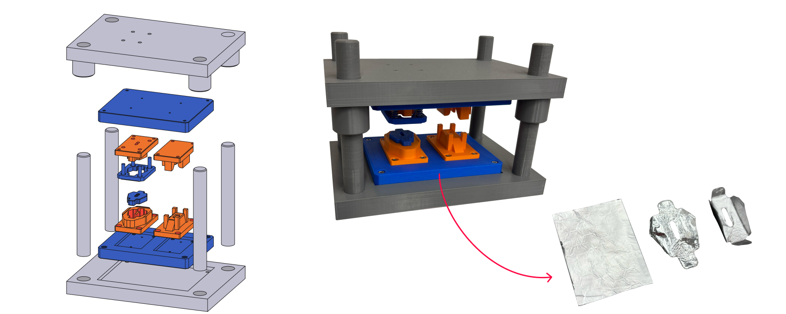

# 3D-Printable Tactile Forming Tool Models for Teaching

This repository provides the 3D-printable tactile tool models and supporting teaching materials that accompany the article:

> Sampaio RFV, Rosado PMS, Pragana JPM, Bragança IMF, Silva CMA, Martins PAF (2026). *A Hybrid Project Based Leaning Approach for MSc Advanced Metal Forming Courses*. Advances in Industrial and Manufacturing Engineering, *Submitted for publication*.

The models are physical, hands-on representations of industrial forming tools. They were developed to help students understand tool architecture, the kinematics of the forming stages, and how the tool components function together. We share them so that educators can reproduce, adapt and extend the teaching activities described in the article.

---

## Contents

| Folder | Description |
|--------|-------------|
| `models/` | STEP files of all tool components, grouped by tool set |
| `images/` | Rendered views and photographs of the printed models |

The complete set of STEP files is also available as a single zip archive under [Releases](../../releases).

---

## Tool Sets

### (a) Modular single-stage vertical tool

`models/vertical_tool/`

[One to two sentences describing the tool: the forming operation it represents, its main components, and the concept it is used to teach, e.g. the function of the punch, die and stripper plate.]

### (b) Double-action horizontal tool

`models/double_action_tool/`

[One to two sentences describing the tool: the two independent actions it represents and the concept it is used to teach.]

### (c) Multi-stage combination tool

`models/multi_stage_tool/`

[One to two sentences describing the tool: the sequence of stages it represents and the concept it is used to teach, e.g. the progression of the part through successive operations.]

---

## Printing Recommendations

The models were printed and tested with the following settings:

| Parameter | Value |
|-----------|-------|
| Process | FDM |
| 3D printer | Bambu Lab X1-Carbon |
| Material | PLA |
| Travel speed | 120 mm/s |
| Layer height | 0.2 mm |
| Infill | 25% |
| Supports | Not required |

All dimensions are in millimetres. Moving components are designed with clearances suited to the settings above. If you use another printer or material, you may need to adjust the clearances.

Assembly: M3 bolts and threaded heat set inserts were utilized to assemble the different parts of the tools. Guide pillars are recommended to be lightly sanded for better sliding in the top bosters; the assembly of the pillars into the bottom bolsters is force-fit so it stays fixed. 

---

## Teaching Materials

Refer to the article for how these materials were integrated into the course and for the evaluation of the learning outcomes.

---

## Citation

If you use these materials in your teaching or research, please cite the article above and this repository:

> [Author(s)] ([Year]). *[Repository title]* (Version 1.0) [Data set]. Zenodo. https://doi.org/[Zenodo DOI]

## License

The models and teaching materials are released under the [Creative Commons Attribution 4.0 International License (CC BY 4.0)](https://creativecommons.org/licenses/by/4.0/). You may share and adapt them for any purpose, provided appropriate credit is given.

## Contact

Rui F.V. Sampaio, IDMEC, Instituto Superior Técnico, Universidade de Lisboa, Portugal, rui.f.sampaio@tecnico.ulisboa.pt
