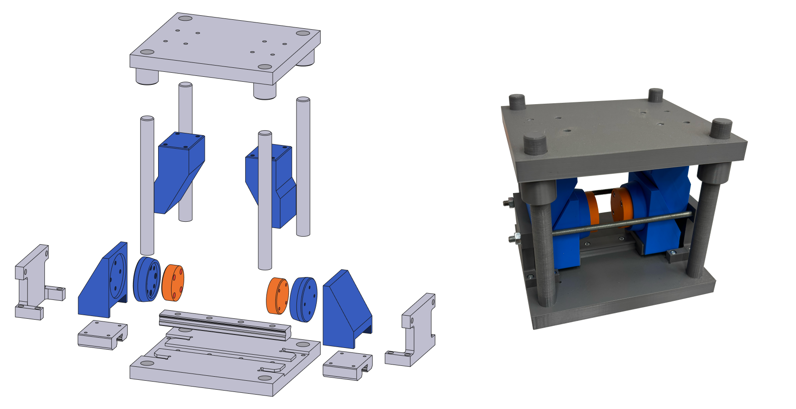

# Double-action horizontal tool

The double-action horizontal set incorporates cam-slide unit components, including wedges, wedge actuators, sliders, and rails, to convert vertical motion into horizontal motion. It also employs horizontal M10 tension bolts and stoppers to ensure tool rigidity during forming operations. 

## Parts list

| No. | Part Name | STEP File | Classification | Quantity |
|----:|-----------|-----------|:--------:|
| 1 | Bottom bolster | `DA_structural_components_gray/bottom_bolster_horiz.step` | Structural | 1 |
| 2 | Upper bolster | `DA_structural_components_gray/top_bolster_horiz.step` | Structural | 1 |
| 3 | Guide pillar | `DA_structural_components_gray/pillar_horiz.step` | Structural | 4 |
| 4 | Side stopper | `DA_structural_components_gray/side_stopper.step` | Structural | 2 |
| 4 | Slider | `DA_structural_components_gray/slider.step` | Structural | 2 |
| 5 | Rail | `DA_structural_components_gray/rail.step` | Structural | 1 |
| 6 | Support plate | `DA_passive_components_blue/support_plate_horiz.step` | Passive | 2 |
| 7 | Wedge | `DA_passive_components_blue/wedge.step` | Passive | 2 |
| 8 | Wedge actuator | `DA_passive_components_blue/wedge_actuator.step` | Passive | 2 |
| 9 | Circular die | `DA_active_components_orange/die_horiz.step` | Active | 2 |

**Total number of printed parts:** 19

## Printing notes
The color scheme utilized in the paper was structural components as gray, passive components as blue, and active components as orange. Therefore, the folder names follow this scheme.

## Assembly notes
M3 socket head bolts and threaded heat set inserts were utilized to assemble the different parts of the tools. Guide pillars are recommended to be lightly sanded for better sliding in the top bosters; the assembly of the pillars into the bottom bolsters is force-fit so it stays fixed.
Additionally, the double-action horizontal tool makes use of horizontal M10 threaded rods (to serve as tension bolts) and nuts.