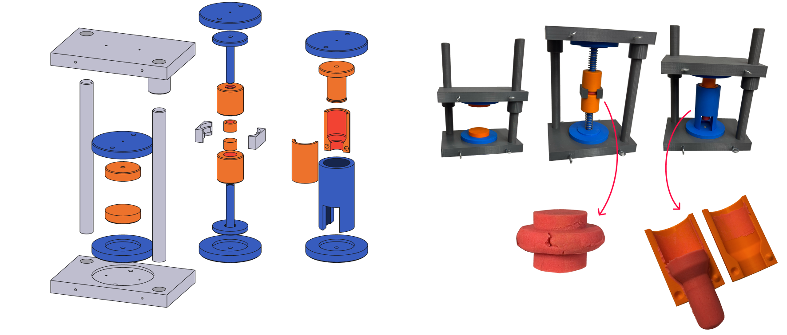

# Modular single-stage vertical tool

The modular single-stage vertical tool demonstrates the fundamental components of metal forming tools and the potential for flexibility in the construction of both structural and passive elements, such as support plates. 
For demonstration purposes, the tool is assembled using cylindrical magnets measuring 5 mm in diameter and 2 mm in thickness. Three configurations were developed: an open-die forging set with flat dies, a double-action radial extrusion set with floating dies and two identical steel springs, and a forward extrusion set. In the latter two configurations, plasticine is placed within the die cavities to enable the corresponding forming operations during instructional sessions.
While not representative of industrial practice, the container in the forward extrusion set is divided along the symmetry plane to facilitate removal of the formed plasticine billet, and the container support features a hole at the base to allow observation of the extrusion process.

## Parts list

| No. | Part Name | STEP File | Classification | Quantity |
|-----|-----------|-----------| -------------- | -------- |
| 1 | Bottom bolster | `V_structural_components_gray/bolsterbottom.step` | Structural | 1 |
| 2 | Upper bolster | `V_structural_components_gray/bolster_top.step` | Structural | 1 |
| 3 | Guide pillar | `V_structural_components_gray/pillar.step` | Structural | 2 |
| 4 | Spacer | `V_structural_components_gray/spacer.step` | Structural | 2 |
| 5 | Support plate | `V_passive_components_blue/support_plate.step` | Passive | 2 |
| 6 | Punch holder | `V_passive_components_blue/punch_holder.step` | Passive | 2 |
| 7 | Stress ring | `V_passive_components_blue/stress_ring.step` | Passive | 1 |
| 8 | Circular die | `V_active_components_orange/die.step` | Active | 2 |
| 9 | Extrusion punch | `V_active_components_orange/ext_punch.step` | Active | 1 |
| 10 | Extrusion half container | `V_active_components_orange/half_container.step` | Active | 2 |
| 11 | Floating container | `V_active_components_orange/container.step` | Active | 2 |
| 12 | Floating punch | `V_active_components_orange/punch.step` | Active | 2 |

**Total number of printed parts:** 19

## Printing notes
The color scheme utilized in the paper was structural components as gray, passive components as blue, and active components as orange. Therefore, the folder names follow this scheme.

## Assembly notes
M3 socket head bolts and threaded heat set inserts were utilized to assemble the different parts of the tools. Guide pillars are recommended to be lightly sanded for better sliding in the top bosters; the assembly of the pillars into the bottom bolsters is force-fit so it stays fixed.
Additionally, the modular single-stage vertical tool makes use of cylindrical magnets measuring 5 mm in diameter and 2 mm in thickness for quick demonstration purposes.